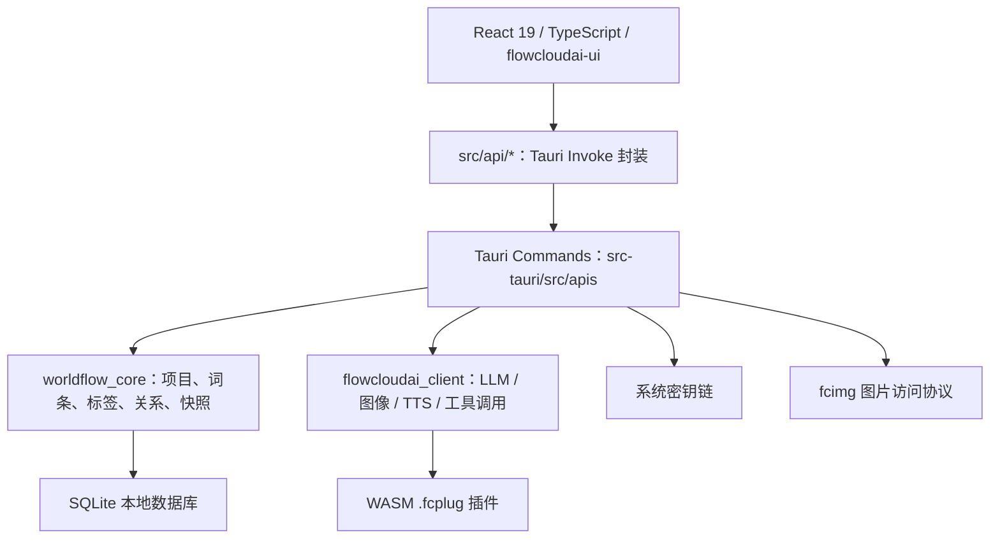

# 流云AI（FlowCloudAI）

> 面向创意写作、世界观设定与知识管理的 AI 驱动桌面工作台。

流云AI 不是一个单纯的聊天窗口，而是把「项目资料库」「结构化词条」「关系网络」「AI 协作」「插件化模型接入」放在同一个桌面应用里的创作系统。它面向长篇小说、剧本、游戏世界观、TRPG 设定、知识整理等需要长期维护大量资料的场景，帮助创作者把灵感、设定、人物、地点、事件和 AI 生成内容沉淀为可检索、可关联、可回溯的本地知识资产。

应用前端使用 React 19 + TypeScript + Vite，桌面端由 Tauri v2 和 Rust 驱动；数据以本地 SQLite 为核心，通过 `worldflow_core` 管理项目与词条，通过 `flowcloudai_client` 接入 LLM、图像生成、TTS 和 WASM 插件。

---

## 为什么做这个项目

创作类项目的难点通常不在于“写一段文字”，而在于长期维护一整套复杂设定：

- 人物关系、地点、组织、事件、时间线不断增长；
- AI 可以提供灵感，但上下文、约束和已有设定很容易丢失；
- 普通文档缺少结构化关系，普通知识库又很难服务创作流程；
- 多家模型能力不同，创作者不应该被单一 API 或供应商绑定；
- 设定修改后需要能回看历史、排查矛盾、保持一致性。

流云AI 的目标是把这些问题放在一个本地优先的创作工作台里解决：资料进入词条系统，词条之间形成关系图，AI 通过受控工具读取上下文并辅助创作，模型能力通过插件扩展。

---

## 项目亮点

### 创作知识库，而不是普通笔记

- 以“项目”为单位组织作品资料，适合长篇世界观、系列设定和多作品管理。
- 词条支持分类、类型、标签体系、内链、图片与关系数据，不只是纯文本页面。
- 支持人物、地点、组织、事件、物品、概念等设定对象的结构化管理。
- 词条关系支持单向和双向表达，可服务人物关系、阵营冲突、地理归属、事件因果等创作语义。

### AI 深度进入资料库

- AI 对话支持流式输出、推理过程展示、工具调用和会话分支回溯。
- Rust 后端会为 AI 构建项目上下文，支持摘要、扩写、灵感扩展、矛盾检测、图像提示词生成等任务。
- LLM 工具可检索项目、词条、分类、标签和关系网络，避免 AI 只凭当前聊天记录回答。
- 涉及写入类操作时，通过前端确认再落库，降低误改资料的风险。

### 插件化模型接入

- 模型能力通过 `.fcplug` 插件扩展，插件包本质是包含 `manifest.json`、`plugin.wasm` 和图标资源的 ZIP 包。
- 插件运行在 Wasmtime Component Model 沙箱内，宿主通过统一协议完成请求映射、响应映射和流式输出解析。
- 当前架构覆盖 LLM、图像生成和 TTS，便于同时接入 DeepSeek、通义千问等不同服务。
- API Key 通过系统密钥链保存，不写入普通配置文件。

### 可视化世界观

- 关系图由 Rust 后端确定性布局引擎计算，适合稳定复现和调试复杂关系网络。
- 项目编辑器包含时间线、地图与形状编辑能力，用于表达事件顺序和空间设定。
- 关系、时间、地图与文本词条共享同一套项目数据，减少多工具之间的信息割裂。

### 本地优先与可回溯

- 核心创作数据落在本地 SQLite，适合离线整理和长期保存。
- 快照能力基于后端版本管理实现，可用于对项目阶段状态做留档。
- 自定义 `fcimg` 图片访问协议限制读取范围，避免任意路径暴露给前端页面。
- Tauri CSP 与 capability 配置只开放应用需要的权限。

---

## 典型工作流


---

## 功能版图

| 模块 | 能力 |
|------|------|
| 项目管理 | 创建、编辑、切换和维护创作项目 |
| 词条系统 | 富文本/Markdown 编辑、分类、标签体系、词条类型、图片、内链 |
| 关系系统 | 单向/双向词条关系、关系图展示、后端确定性布局 |
| AI 对话 | 流式输出、推理片段、工具调用、工具结果、会话轮次事件、分支回溯 |
| AI 创作任务 | 设定补全、摘要、扩写、灵感扩展、矛盾检测、图像提示词生成 |
| 插件系统 | 本地 `.fcplug` 安装、远程市场拉取、版本检查、插件引用保护 |
| 多媒体能力 | 文生图、图像编辑、TTS 语音合成，具体能力由插件决定 |
| 地图与时间线 | 地图形状编辑、语义地图生成设计、项目时间线视图 |
| 快照 | 项目阶段快照、历史留档与回溯 |
| 设置与安全 | API Key 密钥链存储、主题预加载、单实例桌面运行 |

---

## 架构概览



### 前端层

- `src/app/` 提供桌面端、入口页和移动端应用外壳。
- `src/features/` 按业务域组织 AI 对话、词条、地图、插件、项目编辑器、关系图和快照等模块。
- `src/api/` 是唯一的 Tauri 调用入口，前端业务代码不直接调用 `@tauri-apps/api` 的 `invoke`。
- UI 依赖内部组件库 `flowcloudai-ui`，统一主题 token 与基础组件风格。

### Rust 后端层

- `src-tauri/src/apis/` 暴露 Tauri Commands，覆盖 AI、插件、worldflow 数据、地图、模板、设置和 WebView 控制。
- `src-tauri/src/tools/` 将数据库查询能力注册为 LLM 可调用工具。
- `src-tauri/src/ai_services/` 负责 AI 上下文构建、Artifact 解析和矛盾检测加载。
- `src-tauri/src/layout/` 提供确定性关系图布局引擎。
- `src-tauri/src/map/` 提供地图生成与形状编辑相关后端服务。

### 插件层

- `.fcplug` 插件由 WASM 组件实现，宿主统一调用 `map-request`、`map-response`、`map-stream-line`。
- 插件市场相关逻辑位于 `src-tauri/src/apis/plugins/`，包含本地扫描、远程市场、下载、版本比对与安装卸载。
- 当前安装/卸载会检查活跃会话和引用计数，避免正在使用中的插件被移除。

---

## 技术栈

| 层级 | 技术 |
|------|------|
| 桌面框架 | Tauri 2 |
| 前端 | React 19、TypeScript 5.9、Vite 6 |
| UI | `flowcloudai-ui`、原生 CSS 变量、React Hooks |
| 国际化 | `i18next`、`react-i18next`，支持 `zh-CN` / `en-US` |
| 可视化 | `@xyflow/react`、`@deck.gl/*`、`@pixi/react`、`pixi.js` |
| Markdown | `@uiw/react-md-editor` |
| 后端 | Rust Edition 2024、Tokio、Tauri Commands |
| 数据库 | SQLite，通过 `worldflow_core` 封装 |
| AI 客户端 | `flowcloudai_client`，支持 WASM 插件、工具调用、流式会话 |
| 密钥存储 | `keyring` 系统密钥链 |
| 模板 | Tera Prompt 模板 |
| 检查 | ESLint 9、`typescript-eslint`、Rust 单元测试 |

---

## 目录结构

```text
app_main/
├── src/                      # 前端源码
│   ├── api/                  # Tauri invoke 封装
│   ├── app/                  # 应用外壳：desktop / index / mobile
│   ├── features/             # 业务功能模块
│   ├── i18n/                 # 国际化配置与语言包
│   ├── pages/                # 页面级组件
│   ├── shared/               # 共享 UI、工具与日志
│   └── main.tsx              # 主题预加载后挂载 React
├── src-tauri/                # Tauri / Rust 后端
│   ├── src/
│   │   ├── apis/             # 暴露给前端的 Tauri Commands
│   │   ├── ai_services/      # AI 上下文、Artifact、矛盾检测
│   │   ├── layout/           # 确定性关系图布局
│   │   ├── map/              # 地图生成与编辑服务
│   │   ├── reports/          # 报告生成
│   │   ├── senses/           # AI Sense 预设
│   │   └── tools/            # LLM 工具注册与 worldflow 工具
│   ├── capabilities/         # Tauri 权限配置
│   ├── icons/                # 应用图标
│   └── tauri.conf.json       # Tauri 应用配置
├── docs/                     # 插件、布局、地图、Prompt 等设计文档
├── public/                   # 静态资源
├── package.json
└── vite.config.ts
```

---

## 快速开始

### 环境要求

- Node.js
- Rust 工具链
- Tauri v2 所需系统依赖
- 本仓库相邻目录中的本地依赖：
  - `../core_ai_client`
  - `../core_world_data`
  - `../lib_ui/ui`

### 安装与运行

```bash
cd app_main

# 安装前端依赖
npm install

# 启动完整桌面开发模式，会同时拉起 Vite 和 Rust 后端
npm run tauri -- dev

# 仅启动前端开发服务器
npm run dev
```

`vite.config.ts` 使用端口 `5175`，Tauri `devUrl` 与该端口保持一致。

### 构建

```bash
# 仅构建前端
npm run build

# 构建完整桌面应用
npm run tauri -- build

# Windows 构建
npm run tauri:build:windows

# Linux 构建
npm run tauri:build:linux
```

当前 Tauri bundle 目标包含 Windows NSIS、Linux deb 和 AppImage。Android 辅助脚本也已保留在 `package.json` 中：

```bash
npm run android:dev
npm run android:build:apk
```

---

## 开发验证

```bash
# 前端类型检查与 Vite 构建
npm run build

# 前端 lint
npm run lint

# Rust 后端测试
cd src-tauri
cargo test
```

涉及前端代码时，请先阅读根级 `../docs/前端风格指南.md`；涉及子系统实现时，请优先查看本目录的 `AGENTS.md` 和相关 `docs/` 设计文档。

---

## 安全与隐私

- API Key 通过系统密钥链保存，不写入 `settings.json`。
- 应用设置文件存储在系统应用配置目录，不包含敏感密钥。
- 自定义 `fcimg` 协议只允许访问数据库同级 `images/` 目录下的图片。
- Tauri CSP 限制脚本、样式、图片和远程资源来源。
- capabilities 只授予窗口、文件打开、日志、对话框等必要权限。
- 发布模式下禁用 WebView 右键菜单，并启用单实例运行。

---

## 相关文档

- [`AGENTS.md`](AGENTS.md)：应用开发约定、模块划分与检查清单
- [`docs/plugin_system_guide.md`](docs/plugin_system_guide.md)：插件系统架构与 `.fcplug` 包格式
- [`docs/prompt_README.md`](docs/prompt_README.md)：Prompt、AI Tools 与上下文构建说明
- [`docs/tauri_deterministic_layout_engine.md`](docs/tauri_deterministic_layout_engine.md)：关系图布局引擎设计
- [`docs/semantic_map_generation_design.md`](docs/semantic_map_generation_design.md)：语义地图生成设计
- [`docs/map_shape_editor_backend_mvp.md`](docs/map_shape_editor_backend_mvp.md)：地图形状编辑器后端 MVP
- [`docs/tauri_android_dev_debugging.md`](docs/tauri_android_dev_debugging.md)：Android 开发调试记录

---

## 许可证

MIT License

## 贡献方式

提交前请根据改动范围运行 `npm run lint`、`npm run build` 或 `cd src-tauri && cargo test`。涉及前端功能时遵守根级 `../docs/前端风格指南.md`；涉及 Tauri Command、数据库或 AI 插件接口时，同步更新前后端封装和相关设计文档。
