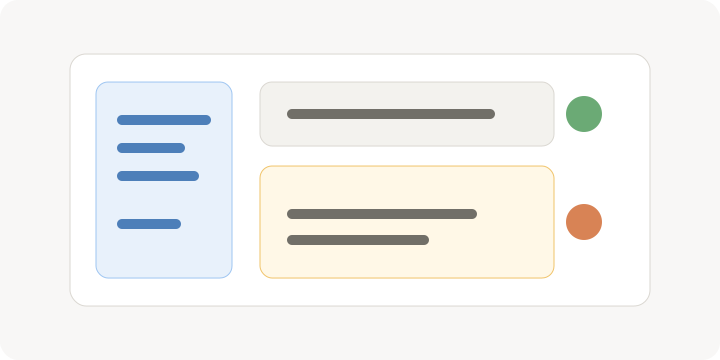

<!-- section:create-world -->
先把作品范围和管理边界定下来，不急着补满所有细节。

_先确定项目边界，再进入分类、词条和辅助工具的工作流。_

- 在首页创建世界观，名称建议使用作品名或企划名。
- 项目简介写清题材、基调和当前阶段，后续 AI 辅助会更稳定。

<!-- section:build-structure -->
分类是长期维护的骨架，先少后多比一次铺满更容易调整。

- 先建立角色、地点、组织、事件等顶层分类。
- 把不确定内容放进灵感便签，确认后再转成正式词条。

<!-- section:first-review -->
第一次复盘的目标是确认能继续写，而不是追求设定完整。

- 用关系图检查关键词条是否孤立。
- 重要改动前保存快照，避免早期试错覆盖掉可用版本。
