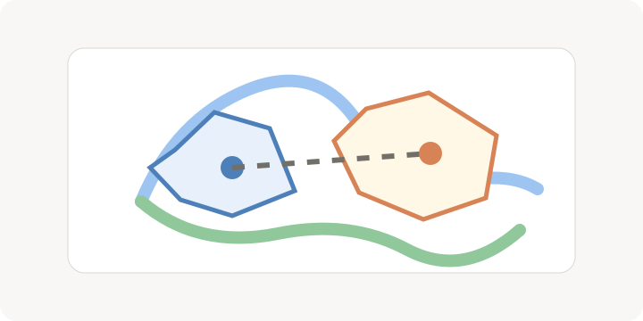

<!-- section:map-purpose -->
地图不是单纯插图，它帮助你确认距离、边界、路线和冲突区域。

_地图帮助你把地点、路线和势力范围放回同一个空间里检查。_

- 先标注叙事中会反复出现的地点。
- 对边境、海岸、山脉这类影响剧情的地理要素保持命名一致。

<!-- section:shape-editing -->
形状适合表达国家、城区、势力范围和特殊区域。

- 编辑前先保存当前项目快照。
- 复杂边界分阶段处理，避免一次修改过多导致难以回退。

<!-- section:map-review -->
地图改动应当回流到词条和事件，不要让地图成为孤立资料。

- 重要地点改名后同步检查相关词条。
- 跨区域事件写作前先确认路线和距离是否合理。
