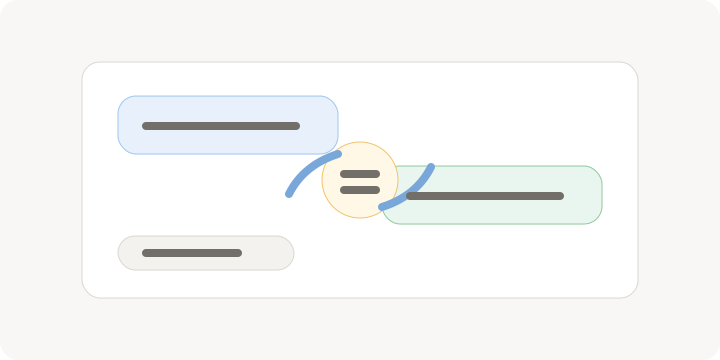

<!-- section:plugin-source -->
流云AI使用 .fcplug 插件接入模型、图像生成和语音能力。

_插件负责把本地应用和具体模型能力连接起来。_

- 插件包通常包含 manifest、wasm 模块和图标。
- 只安装来源明确、与你当前需求匹配的插件。

<!-- section:api-key -->
API Key 属于敏感信息，应当交给系统密钥链保存。

- 在设置页为对应插件配置 API Key。
- 不要把真实密钥写入普通配置文件、模板或项目文档。

<!-- section:plugin-errors -->
插件失败通常来自安装状态、密钥、网络或模型名称。

- 先确认插件已安装并能读取模型列表。
- 再检查密钥状态、网络连接和模型名称是否匹配。
